# SistemaWeb
1 PARTE: 
Se crea las carpetas, en APP donde en una carpeta llamada "bussiness", se creara otras 4 carpetas, cada auna tiene una funcionaliddad diferente para la pagina, cada una tiene el nombre de "bussiness", "dashboard", "login", "perfil", "tablas". 
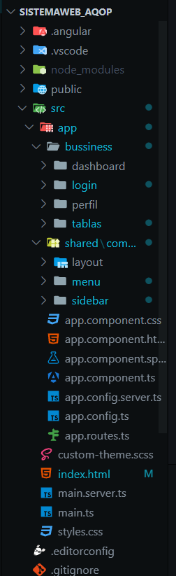
En la carpeta "Dashboard", solo contiene por default los componentes de Angular, cuando se crea la carpeta, ya que mas adelante se estara implementando funcionalidades especificas para el usuario. 
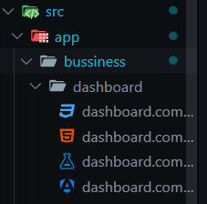
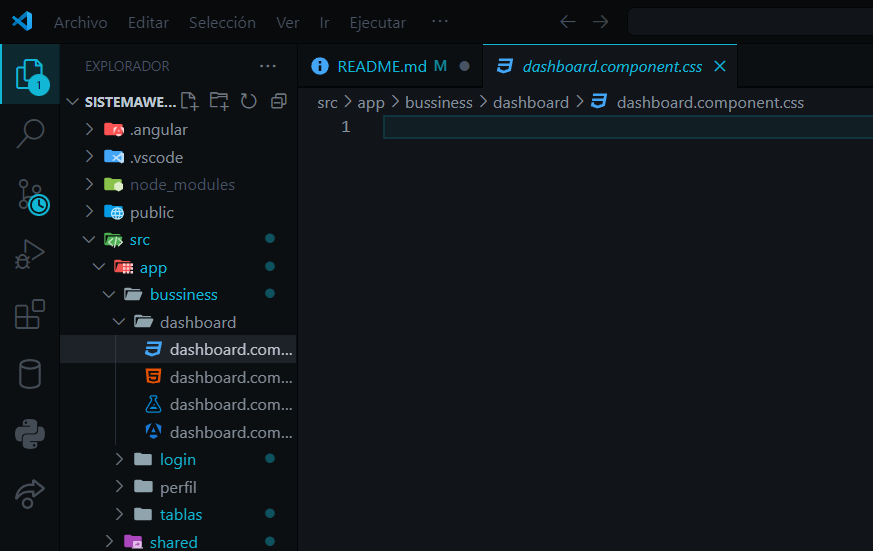
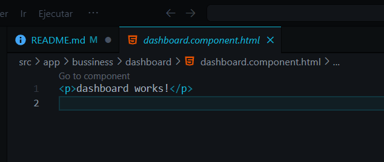
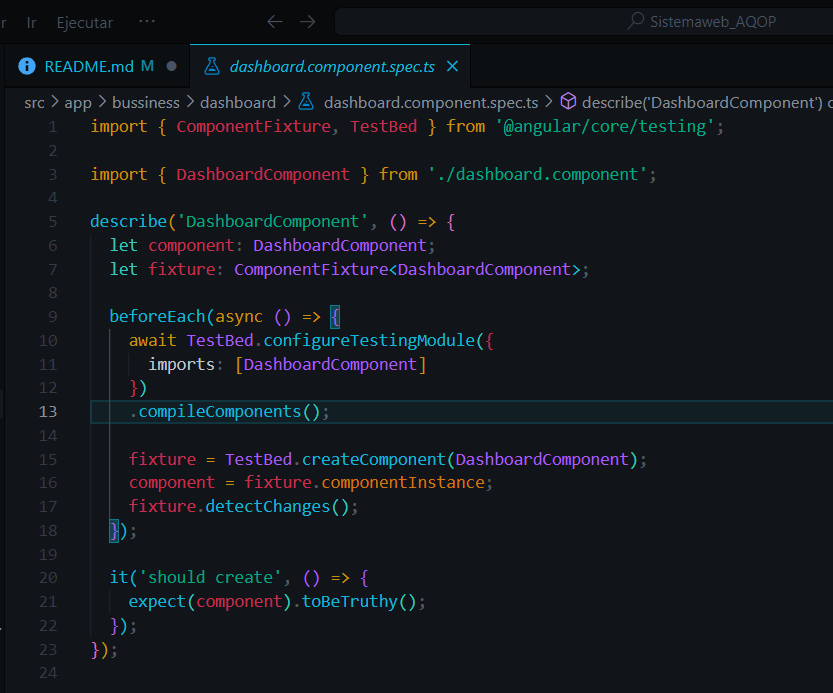

En la carpeta login, es ahi donde implemente mis funcionalidades para que el usuario pueda ingresar sus datos en base a la API, que uso en el anterior trabajo,
como ya tenia el trabajo hecho del login que se puede encontrar en este enlace: https://github.com/Andrea85Ordonez/LoginAngular.git, solamente copie y pegue para este trabajo.
Adjunto imagenes de que se esta cumpliendo
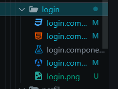
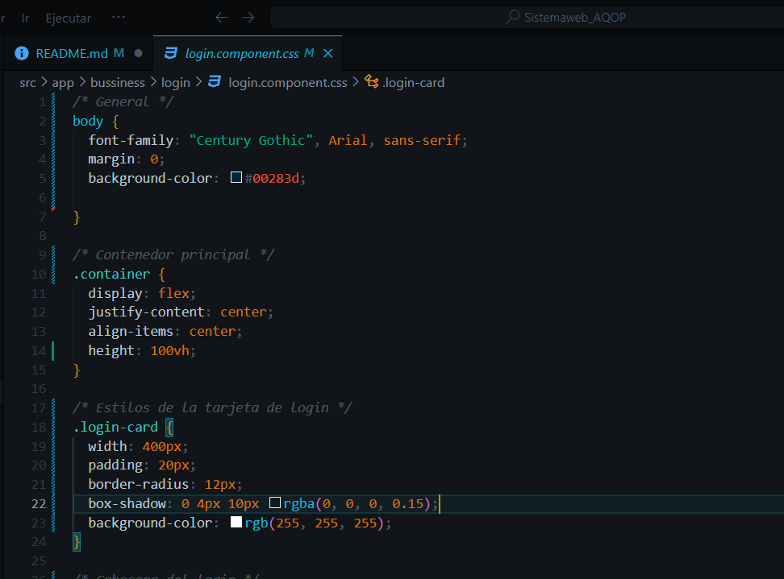
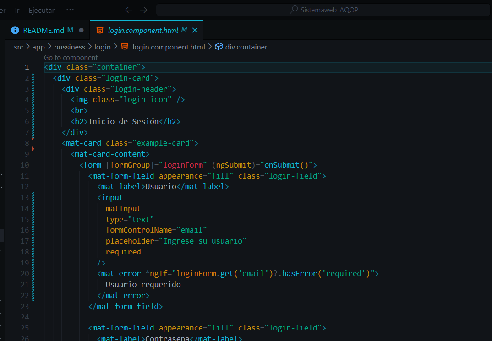
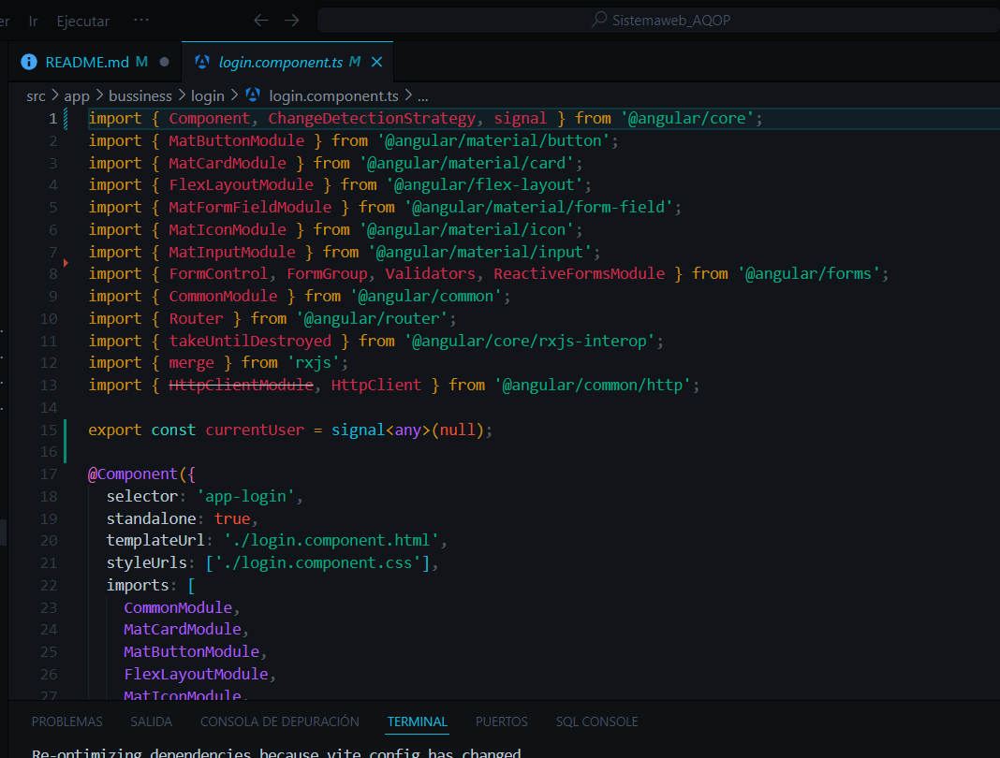
*************************************************************************************************************************************************
2 PARTE
En esta parte en la carpeta "Perfil", de igual forma no implemente nada, mas que por defautl los componentes que estan cuando se crea la carpeta,
asi como se muestra en las imagenes
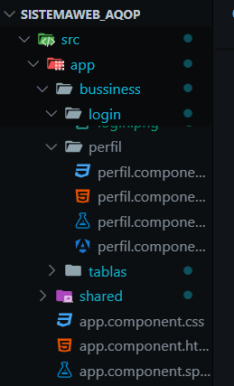
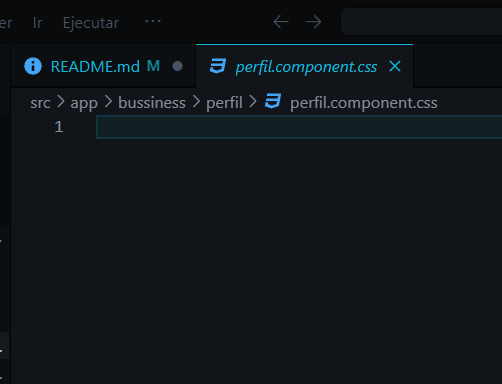
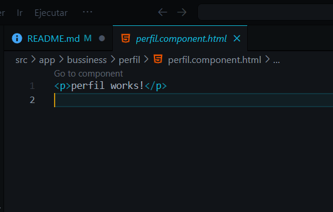
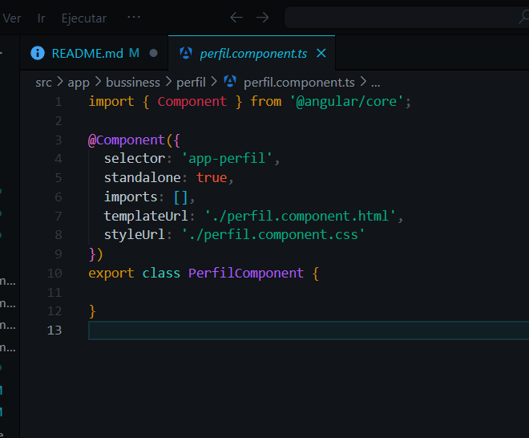

En la carpeta "Tablas", es donde se desarrolla la mayoria del trabajo, ya que ahi mismo esta la tabla que debe mostrar los componentes y funcionalidades, de la cual se uso una API, que contiene imagenes con su respectiva informacion. Adjunto codigo e imagenes de como es que se fue implementando en los archivos. 
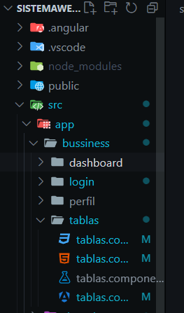
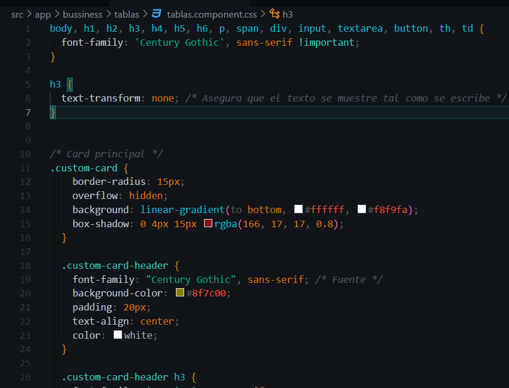
body, h1, h2, h3, h4, h5, h6, p, span, div, input, textarea, button, th, td {
  font-family: 'Century Gothic', sans-serif !important;
}

h3 {
  text-transform: none; /* Asegura que el texto se muestre tal como se escribe */
}

/* Card principal */
.custom-card {
    border-radius: 15px;
    overflow: hidden;
    background: linear-gradient(to bottom, #ffffff, #f8f9fa);
    box-shadow: 0 4px 15px rgba(166, 17, 17, 0.8);
  }
  
  .custom-card-header {
    font-family: "Century Gothic", sans-serif; /* Fuente */
    background-color: #8f7c00;
    padding: 20px;
    text-align: center;
    color: white;
  }
  
  .custom-card-header h3 {
    font-family: 'Poppins', sans-serif;
    letter-spacing: 1px;
  }
  
  
  .custom-card-body {
    padding: 20px;
  }
  
  .custom-card-footer {
    text-align: center; /* Asegura el centrado del contenido */
    padding: 10px; /* Reduce el padding general */
    font-size: 14px; /* Tamaño de texto pequeño */
  }
  
  /* Tabla */
  .custom-table {
    font-family: "Century Gothic", sans-serif; /* Fuente */
    background-color: #ffffff;
    border-radius: 10px;
    overflow: hidden;
  }
  
  .custom-table thead {
    background-color: #2711cb;
    color: white;
  }
  
  .custom-table th {
    padding: 15px;
    text-transform: uppercase;
    letter-spacing: 1px;
  }
  
  .custom-table td {
    padding: 15px;
    vertical-align: middle;
  }
  
  .custom-table tr:hover {
    background-color: rgba(100, 100, 255, 0.1);
    transition: all 0.3s ease-in-out;
  }
  
  /* Botones */
  .custom-btn {
    background-color: #b26d0d;
    color: white;
    border-radius: 50px;
    padding: 8px 20px;
    transition: all 0.3s ease-in-out;
  }
  
  .custom-btn:hover {
    background-color: #000000;
    color: white;
    transform: translateY(-3px);
    box-shadow: 0 5px 15px rgba(0, 0, 0, 0.2);
  }
  
  /* Modal */
  .custom-modal {
    border-radius: 15px;
  }
  
  .custom-modal-header {
    background-color: #000000;
    color: white;
    padding: 15px;
    border-bottom: none;
  }
  
  .custom-modal-body {
    padding: 20px;
  }
  
  .custom-modal-footer {
    padding: 15px;
    border-top: none;
    text-align: center;
  }
  
  .custom-modal-footer button {
    background-color: #000000;
    border: none;
    color: rgb(143, 11, 11);
    border-radius: 50px;
    padding: 10px 20px;
  }
  /* Tarjeta principal */
.card {
    border-radius: 12px;
    overflow: hidden;
  }
  
  .card-header {
    font-family: 'Poppins', sans-serif;
    text-transform: uppercase;
    letter-spacing: 1px;
  }
  
  /* Tabla */
  .table {
    margin: 0;
    font-family: 'Roboto', sans-serif;
  }
  
  .table-hover tbody tr:hover {
    background-color: rgba(0, 123, 255, 0.1);
    transition: background-color 0.3s ease;
  }
  
  .table-striped tbody tr:nth-of-type(odd) {
    background-color: rgba(0, 0, 0, 0.05);
  }
  
  /* Imágenes */
  img.rounded {
    border: 1px solid #dee2e6;
    transition: transform 0.3s ease;
  }
  
  img.rounded:hover {
    transform: scale(1.1);
  }
  
  /* Botones */
  .btn-outline-info {
    color: #05434c;
    border-color: #4ca1af;
  }
  
  .btn-outline-info:hover {
    background-color: #4ca1af;
    color: white;
  }
  
  .btn-light {
    transition: all 0.3s ease;
  }
  
  .btn-light:hover {
    box-shadow: 0px 4px 10px rgb(0, 75, 156);
  }
  
  /* Modal */
  .modal-header {
    border-bottom: none;
  }
  
  .modal-footer {
    border-top: none;
  }
  
  .modal-content {
    border-radius: 12px;
  }
  .search-container {
    max-width: 400px;
    width: 100%;
  }
  
  .pagination-btn {
    font-size: 15px; /* Reduce el tamaño del texto en los botones */
    padding: 15px 10px; /* Botones más pequeños */
    border-radius: 15px; /* Esquinas redondeadas */
    transition: all 0.3s ease; /* Suaviza las interacciones */
  }
  
  .pagination-btn:hover {
    background-color: #6a11cb; /* Cambia color en hover */
    color: white;
    transform: scale(1.05); /* Ligero zoom al pasar el ratón */
  }
  
  span.fw-bold.text-muted {
    font-size: 15px; /* Tamaño más pequeño para el número de página */
  } 
 
  .profile-container {
    display: flex;
    flex-direction: column;
    align-items:flex-end; /* Centra la imagen horizontalmente */
    margin: 10px 0;
  }
  
  .profile-avatar {
    width: 80px; /* Ajusta el tamaño de la imagen */
    height: 80px; /* Asegúrate de mantener un tamaño cuadrado */
    border-radius: 50%; /* Hace la imagen circular */
    object-fit: cover; /* Ajusta la imagen para que no se deforme */
    border: 2px solid #ccc; /* Borde opcional */
  }
  
  .profile-name {
    margin-top: 10px;
    font-size: 14px;
    font-weight: bold;
    color: #333; /* Color del texto */
  }
  

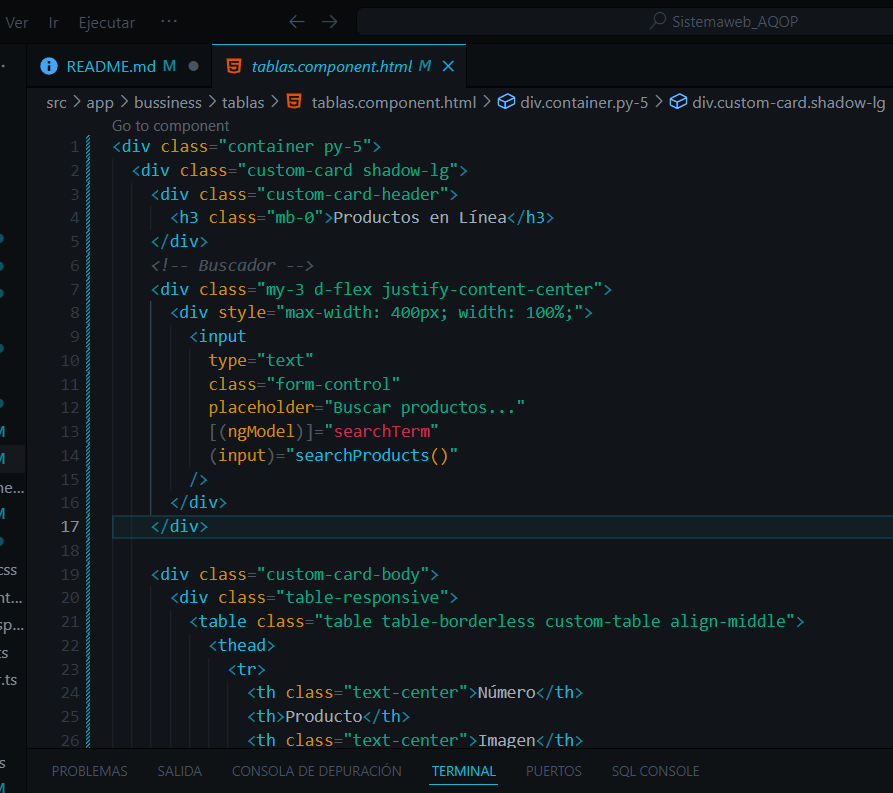

  

    

      <h3 class="mb-0">Productos en Línea</h3>
    

    <!-- Buscador -->
    

      

        <input
          type="text"
          class="form-control"
          placeholder="Buscar productos..."
          [(ngModel)]="searchTerm"
          (input)="searchProducts()"
        />
      

    

    

      

        <table class="table table-borderless custom-table align-middle">
          <thead>
            <tr>
              <th class="text-center">Número</th>
              <th>Producto</th>
              <th class="text-center">Imagen</th>
              <th class="text-center">Acciones</th>
              <th class="text-center">Editar</th>
              <th class="text-center">Eliminar</th>
            </tr>
          </thead>
          <tbody>
            <tr *ngFor="let product of paginatedProducts; let i = index">
              <td class="text-center fw-bold">{{ (currentPage - 1) * itemsPerPage + i + 1 }}</td>
              <td>
                {{ product.title }}
              </td>
              <td class="text-center">
                
              </td>
              <td class="text-center">
                <button
                  class="btn custom-btn"
                  [attr.data-bs-toggle]="'modal'"
                  [attr.data-bs-target]="'#detailsModal'"
                  (click)="openModal(product)"
                >
                  Detalles
                </button>
              </td>
              <td class="text-center">
                <button
                  class="btn btn-primary btn-sm"
                  [attr.data-bs-toggle]="'modal'"
                  [attr.data-bs-target]="'#editModal'"
                  (click)="openEditModal(product)"
                >
                  Editar
                </button>
              </td>
              <td class="text-center">
                <button
                  class="btn btn-danger btn-sm"
                  [attr.data-bs-toggle]="'modal'"
                  [attr.data-bs-target]="'#deleteModal'"
                  (click)="openDeleteModal(product)"
                >
                  Eliminar
                </button>
              </td>
            </tr>
          </tbody>
        </table>
      

    

    

      <button
        class="btn btn-light shadow-sm pagination-btn"
        [disabled]="currentPage === 1"
        (click)="prevPage()"
      >
        <i class="bi bi-arrow-left"></i> Anterior
      </button>
      Página {{ currentPage }}
      <button
        class="btn btn-light shadow-sm pagination-btn"
        [disabled]="(currentPage * itemsPerPage) >= filteredProducts.length"
        (click)="nextPage()"
      >
        Siguiente <i class="bi bi-arrow-right"></i>
      </button>
    

    
  

<!-- Modal para Detalles -->

  

    

      

        <h5 class="modal-title" id="detailsModalLabel">{{ selectedProduct?.title }}</h5>
        <button
          type="button"
          class="btn-close"
          data-bs-dismiss="modal"
          aria-label="Cerrar"
        ></button>
      

      

        
        
{{ selectedProduct?.description }}

      

      

        <button
          type="button"
          class="btn btn-secondary"
          data-bs-dismiss="modal"
        >
          Cerrar
        </button>
      

    

  

<!-- Modal para Editar -->

  

    

      

        <h5 class="modal-title" id="editModalLabel">Editar Producto</h5>
        <button
          type="button"
          class="btn-close"
          data-bs-dismiss="modal"
          aria-label="Cerrar"
        ></button>
      

      

        <form>
          

            <label for="editTitle" class="form-label">Nombre</label>
            <input
              type="text"
              class="form-control"
              id="editTitle"
              [(ngModel)]="editableProduct.title"
              name="title"
            />
          

          

            <label for="editDescription" class="form-label">Descripción</label>
            <textarea
              class="form-control"
              id="editDescription"
              [(ngModel)]="editableProduct.description"
              name="description"
            ></textarea>
          

        </form>
      

      

        <button
          type="button"
          class="btn btn-secondary"
          data-bs-dismiss="modal"
        >
          Cerrar
        </button>
        <button
          type="button"
          class="btn btn-primary"
          (click)="saveChanges()"
        >
          Guardar
        </button>
      

    

  

<!-- Modal para Eliminar -->

  

    

      

        <h5 class="modal-title" id="deleteModalLabel">Confirmar Eliminación</h5>
        <button
          type="button"
          class="btn-close"
          data-bs-dismiss="modal"
          aria-label="Cerrar"
        ></button>
      

      

        

          ¿Estás seguro de que deseas eliminar el producto
          <strong>{{ productToDelete?.title }}</strong>?
        

      

      

        <button
          type="button"
          class="btn btn-secondary"
          data-bs-dismiss="modal"
        >
          No
        </button>
        <button
          type="button"
          class="btn btn-danger"
          data-bs-dismiss="modal"
          (click)="deleteProduct()"
        >
          Sí, eliminar
        </button>
      

    

  

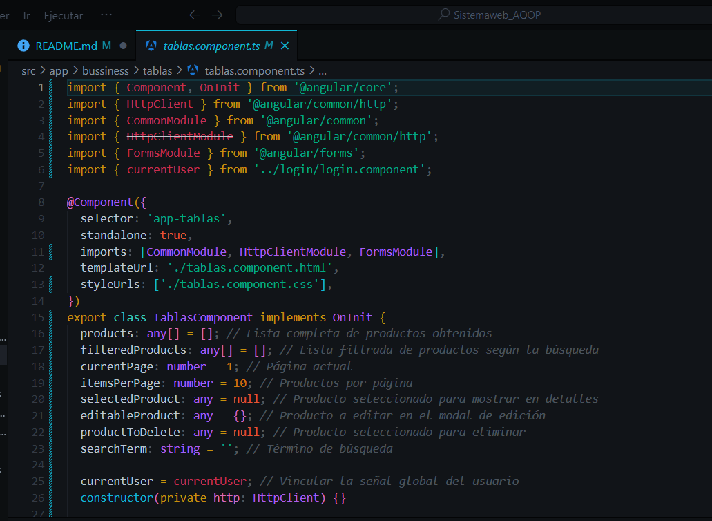
import { Component, OnInit } from '@angular/core';
import { HttpClient } from '@angular/common/http';
import { CommonModule } from '@angular/common';
import { HttpClientModule } from '@angular/common/http';
import { FormsModule } from '@angular/forms';
import { currentUser } from '../login/login.component';

@Component({
  selector: 'app-tablas',
  standalone: true,
  imports: [CommonModule, HttpClientModule, FormsModule],
  templateUrl: './tablas.component.html',
  styleUrls: ['./tablas.component.css'],
})
export class TablasComponent implements OnInit {
  products: any[] = []; // Lista completa de productos obtenidos
  filteredProducts: any[] = []; // Lista filtrada de productos según la búsqueda
  currentPage: number = 1; // Página actual
  itemsPerPage: number = 10; // Productos por página
  selectedProduct: any = null; // Producto seleccionado para mostrar en detalles
  editableProduct: any = {}; // Producto a editar en el modal de edición
  productToDelete: any = null; // Producto seleccionado para eliminar
  searchTerm: string = ''; // Término de búsqueda

  currentUser = currentUser; // Vincular la señal global del usuario
  constructor(private http: HttpClient) {}

  logout() {
    currentUser.set(null); // Limpiar datos del usuario
    console.log('Sesión cerrada');
    alert('Has cerrado sesión.');
  }

  ngOnInit(): void {
    this.fetchProducts(); // Obtiene los productos al cargar el componente
  }

  // Obtiene los productos desde la API de Fake Store
  fetchProducts(): void {
    this.http.get<any>('https://fakestoreapi.com/products').subscribe((response) => {
      this.products = response; // Lista completa de productos
      this.filteredProducts = this.products; // Inicializa la lista filtrada
    });
  }

  // Filtra los productos en base al término de búsqueda
  searchProducts(): void {
    const term = this.searchTerm.toLowerCase(); // Convierte el término a minúsculas
    this.filteredProducts = this.products.filter((product) =>
      product.title.toLowerCase().includes(term)
    );
    this.currentPage = 1; // Reinicia a la primera página
  }

  // Obtiene los productos paginados según la lista filtrada
  get paginatedProducts(): any[] {
    const start = (this.currentPage - 1) * this.itemsPerPage;
    return this.filteredProducts.slice(start, start + this.itemsPerPage);
  }

  // Cambia a la página anterior
  prevPage(): void {
    if (this.currentPage > 1) this.currentPage--;
  }

  // Cambia a la página siguiente
  nextPage(): void {
    if ((this.currentPage * this.itemsPerPage) < this.filteredProducts.length) {
      this.currentPage++;
    }
  }

  // Abre el modal de detalles para mostrar información de un producto
  openModal(product: any): void {
    this.selectedProduct = product;
  }

  // Abre el modal de edición para modificar un producto
  openEditModal(product: any): void {
    this.editableProduct = { ...product }; // Crea una copia del producto seleccionado
  }

  // Guarda los cambios realizados en el producto editado
  saveChanges(): void {
    const index = this.products.findIndex((p) => p.id === this.editableProduct.id);
    if (index !== -1) {
      this.products[index] = { ...this.editableProduct }; // Actualiza el producto en la lista completa
      this.filteredProducts = [...this.products]; // Actualiza la lista filtrada
    }
    this.editableProduct = {}; // Limpia el producto editable
  }

  // Abre el modal de confirmación para eliminar un producto
  openDeleteModal(product: any): void {
    this.productToDelete = product;
  }

  // Elimina un producto seleccionado de las listas
  deleteProduct(): void {
    this.products = this.products.filter((p) => p.id !== this.productToDelete.id);
    this.filteredProducts = this.filteredProducts.filter(
      (p) => p.id !== this.productToDelete.id
    );
    this.productToDelete = null; // Limpia la referencia del producto eliminado
  }
}

************************************************************************************************************************************************
3 PARTE
En una carpeta que se creo y que se llama "shared\component", tiene subcarpetas de la cual en una carpeta que se llama "menu", es una barra lateral que se muestra cuando el usuario ingresa al sistema, por lo que tambien muestra la foto de perfil de quien ingreso, asi mismo contiene enlaces para llevarlo a un area en especifico, en este caso, solamente se tiene la funcionalidad de "Tablas", que mostrara  la informacion de la API que se uso
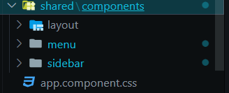
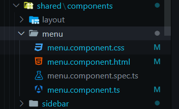
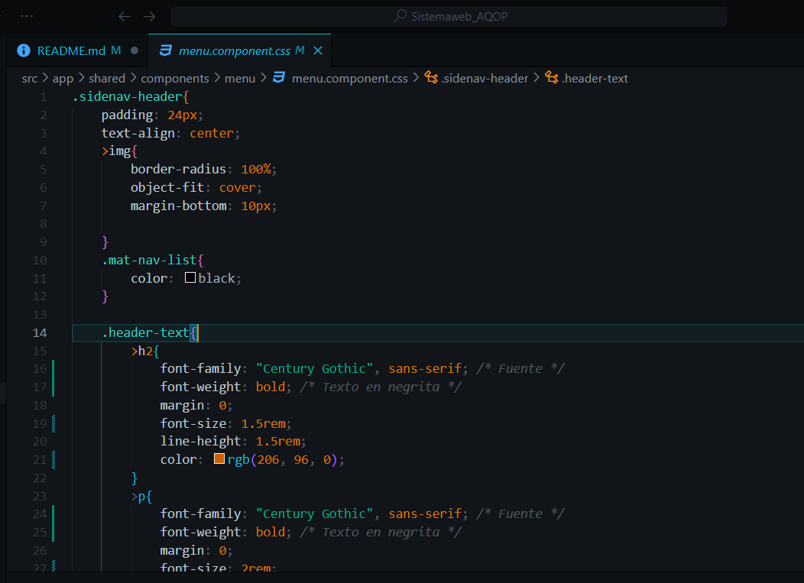
.sidenav-header{
    padding: 24px;
    text-align: center;
    >img{
        border-radius: 100%;
        object-fit: cover;
        margin-bottom: 10px;

    }
    .mat-nav-list{
        color: black;
    }

    .header-text{
        >h2{
            font-family: "Century Gothic", sans-serif; /* Fuente */
            font-weight: bold; /* Texto en negrita */          
            margin: 0;
            font-size: 1.5rem;
            line-height: 1.5rem;
            color: rgb(206, 96, 0);
        }
        >p{
            font-family: "Century Gothic", sans-serif; /* Fuente */
            font-weight: bold; /* Texto en negrita */          
            margin: 0;
            font-size: 2rem;
            color: rgb(25, 0, 75);
        }
    }
    .hide-header-text{
        opacity: 0;
        height: 0px;
    }
}

.profile-container {
    display: flex;
    flex-direction: column;
    align-items: center; /* Centra la imagen horizontalmente */
    margin: 10px 0;
    font-family: 'Century Gothic', sans-serif; /* Aplica Century Gothic */
  }
  
  .profile-avatar {
    width: 80px; /* Ajusta el tamaño de la imagen */
    height: 80px; /* Asegúrate de mantener un tamaño cuadrado */
    border-radius: 50%; /* Hace la imagen circular */
    object-fit: cover; /* Ajusta la imagen para que no se deforme */
    border: 2px solid #ccc; /* Borde opcional */
  }
  
  .profile-name {
    margin-top: 10px;
    font-size: 14px;
    font-weight: bold;
    color: #333; /* Color del texto */
  }
  
  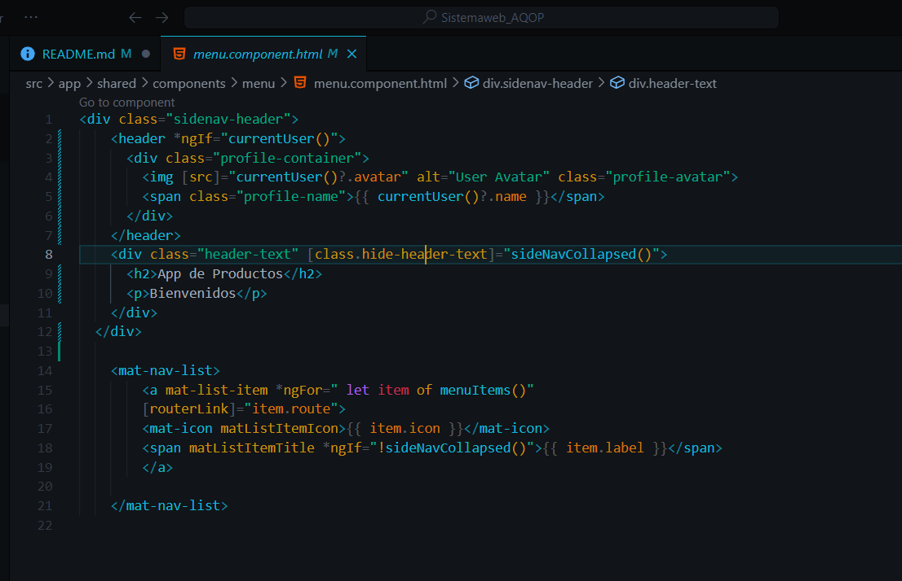
  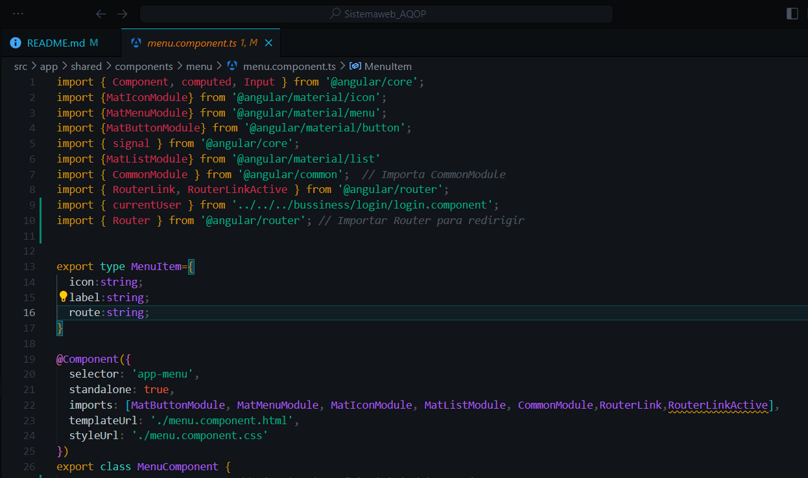
  import { Component, computed, Input } from '@angular/core';
import {MatIconModule} from '@angular/material/icon';
import {MatMenuModule} from '@angular/material/menu';
import {MatButtonModule} from '@angular/material/button';
import { signal } from '@angular/core';
import {MatListModule} from '@angular/material/list'
import { CommonModule } from '@angular/common';  // Importa CommonModule
import { RouterLink, RouterLinkActive } from '@angular/router';
import { currentUser } from '../../../bussiness/login/login.component';
import { Router } from '@angular/router'; // Importar Router para redirigir

export type MenuItem={
  icon:string;
  label:string;
  route:string;
}

@Component({
  selector: 'app-menu',
  standalone: true,
  imports: [MatButtonModule, MatMenuModule, MatIconModule, MatListModule, CommonModule,RouterLink,RouterLinkActive],
  templateUrl: './menu.component.html',
  styleUrl: './menu.component.css'
})
export class MenuComponent {
  currentUser = currentUser; // Vincular la señal global del usuario
  constructor(private router: Router) {} // Inyectar Router
  sideNavCollapsed=signal(false);
  @Input() set collapsed(value: boolean) {
    this.sideNavCollapsed.set(value);
  };
  menuItems=signal<MenuItem[]>([
    {icon: 'home', label: 'Dashboard', route: '/dashboard'},
    {icon: 'person', label: 'Perfil', route: '/perfil'},
    {icon: 'tablas', label: 'Tablas', route: '/tablas'}
  ]);

  profilePicsSize=computed(()=>this.sideNavCollapsed()? '32px' : '100px');
  logout() {
    currentUser.set(null); // Limpiar datos del usuario
    console.log('Sesión cerrada');
    alert('Has cerrado sesión.');
    this.router.navigate(['/login']); // Redirigir al login
  }
}

En la carpeta "Sidebar", de igual forma me permitio diseñar mas estructurado y con mayor presentacion la barra de componentes, simplemente se intego unas palabras de bienvenida y su foto de perfil del usuario, adjunto imagenes
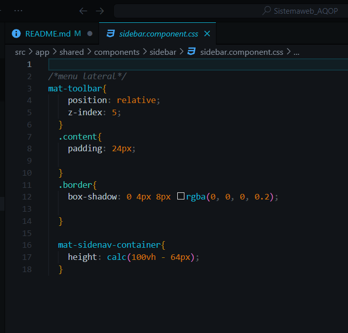 
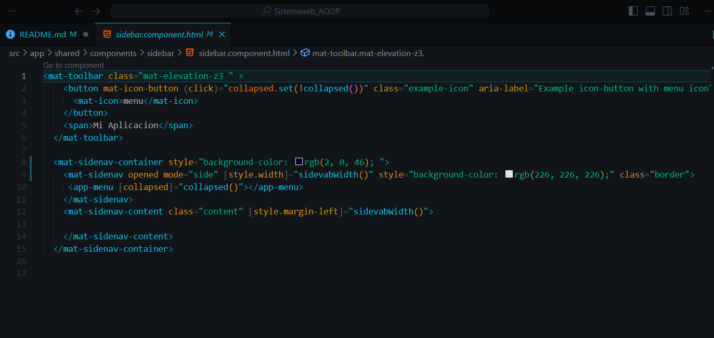
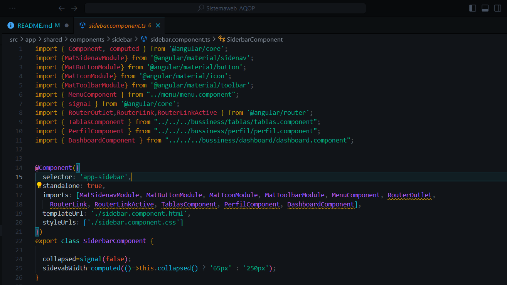

*************************************************************************************************************************************
PRUEBAS DE EJECUCION
Imagen de login, de como es que el usuario, va a ingresar y que sus datos deben de ser validos en base a la API que se uso anteriormente 
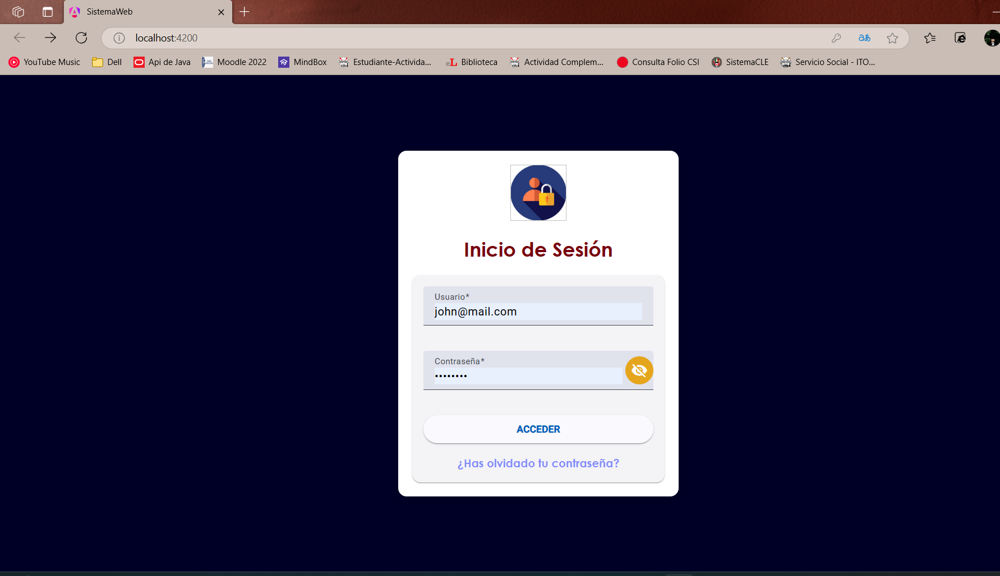
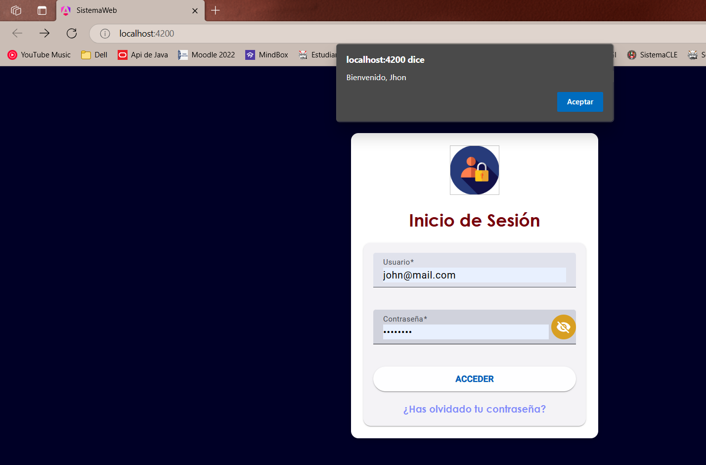
Este es la segunda pagina que se muestra ya que sus datos del usuario que ingreso, fueron validos
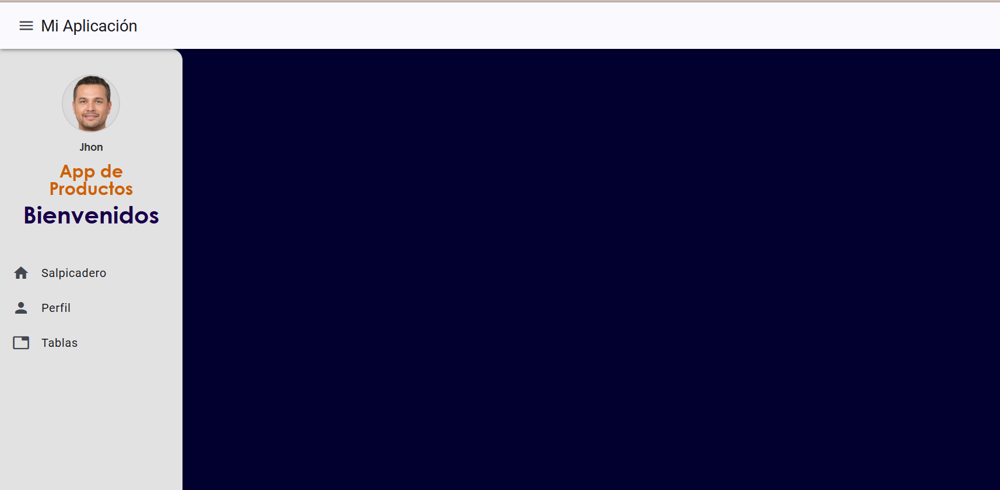
En la parte de la barra lateral de informacion, en la opcion de "Tablas", se mostrara la informacion de la API con imagenes, de la cual tiene una estructura organizada y completa con sus componentes 
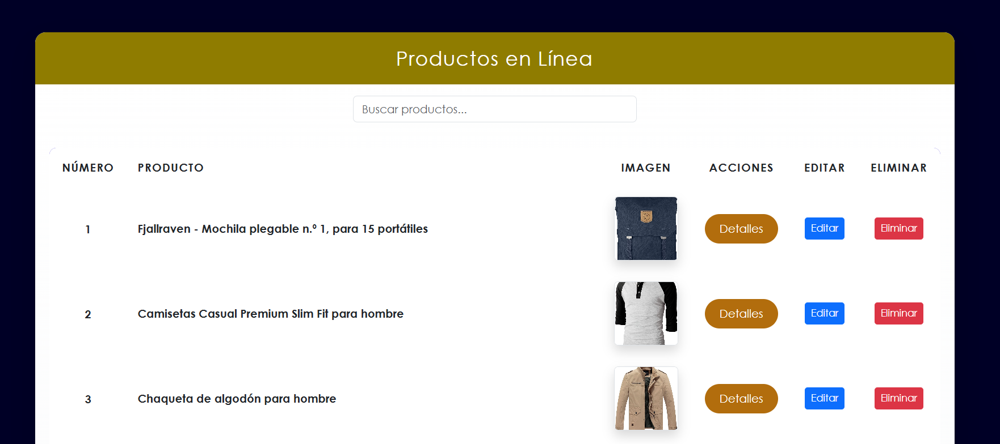

FUNCIONALIDAD DE LOS COMPONENTES 
Para el boton de detalles, se muestra asi 
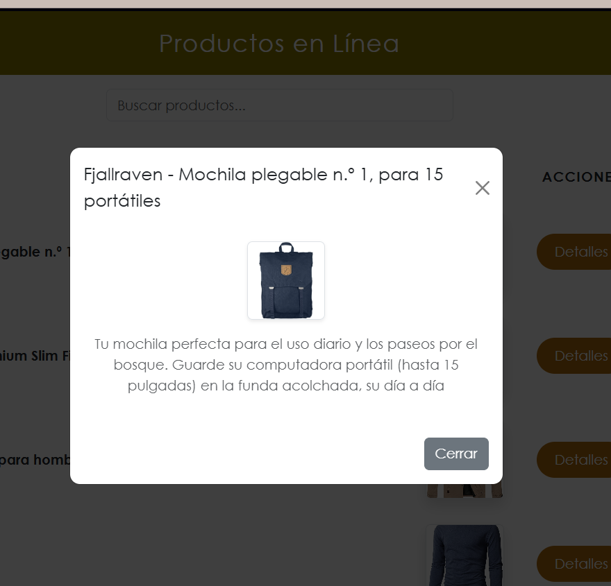
Para el boton de editar se realiza de la siguiente manera
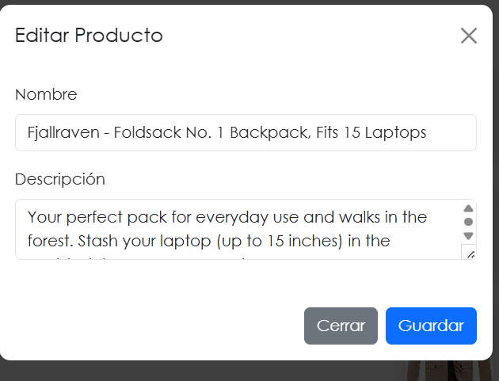
Para el boton de eliminar, muestra la siguiente ventana
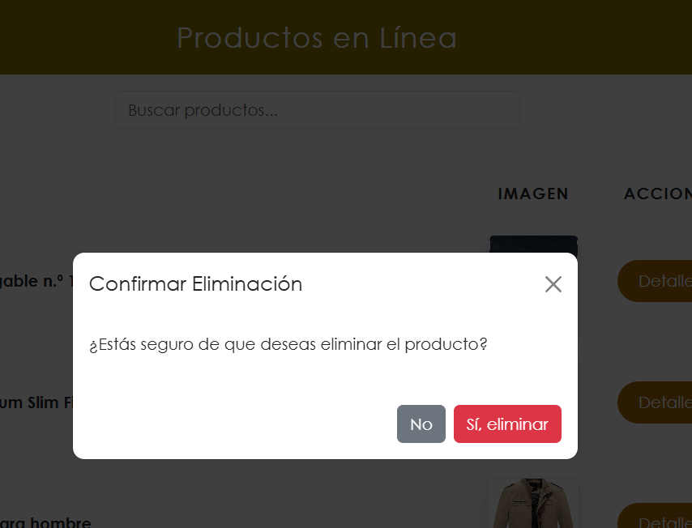
Y para la paginacion se muestra en la parte inferior de la tabla 
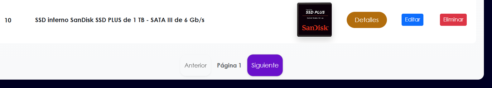

